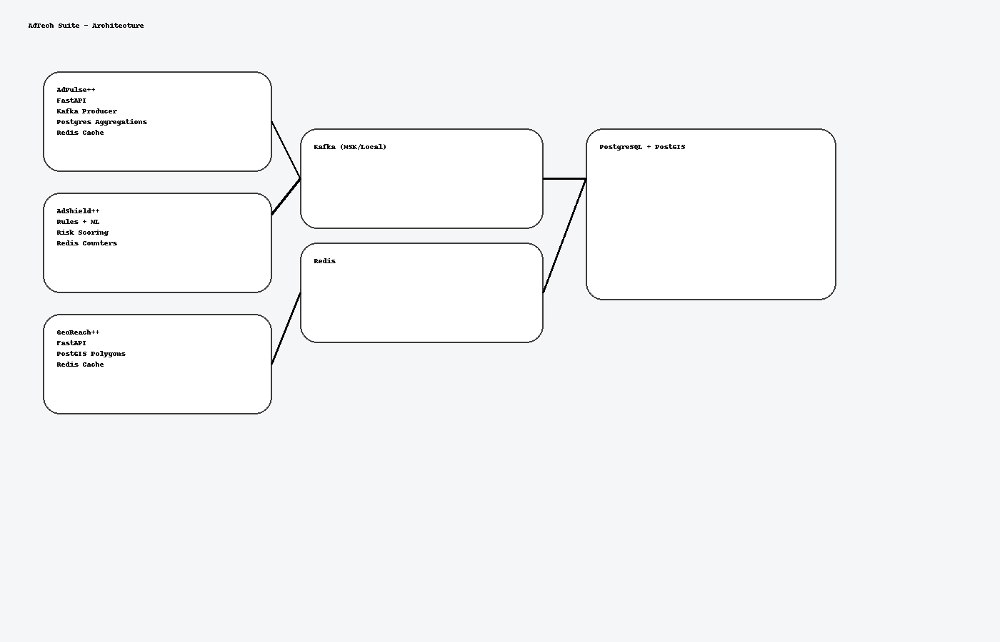
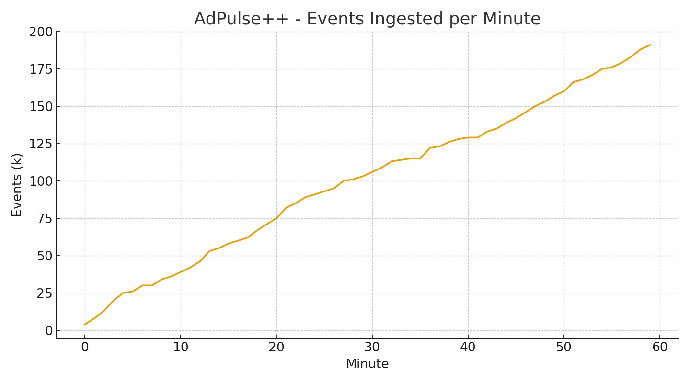
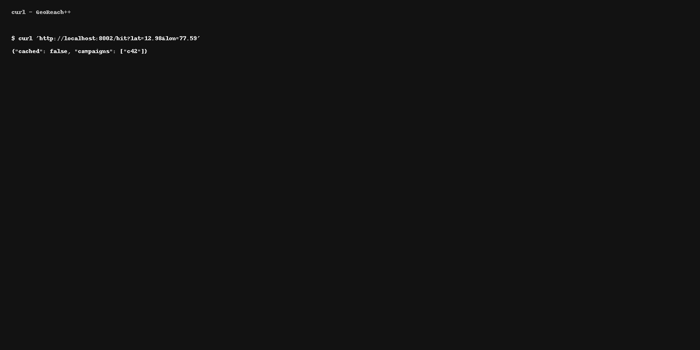
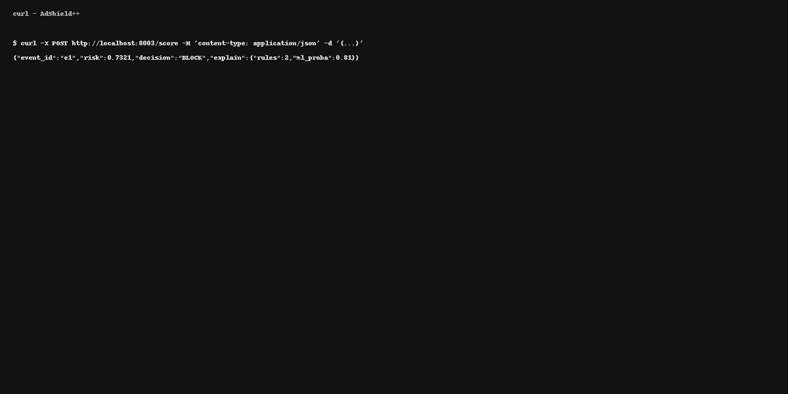
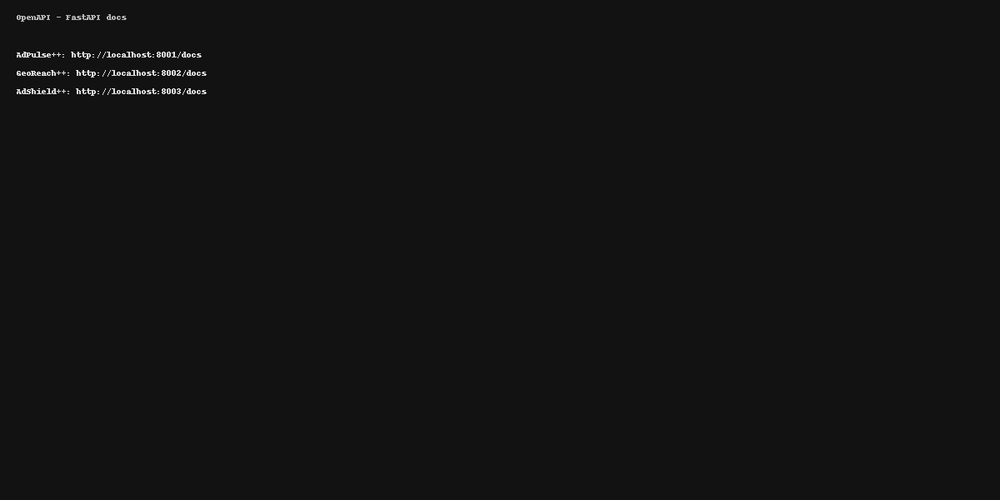
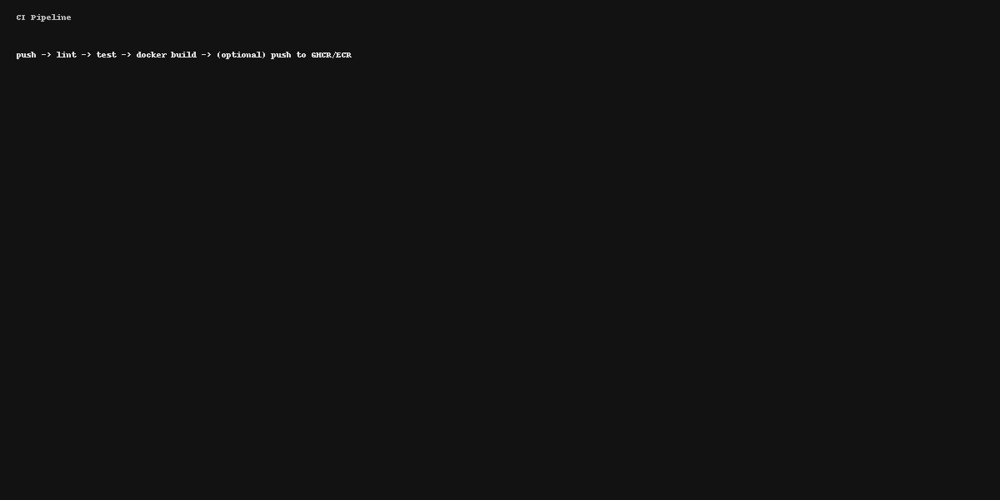

# AdTech Microservices Suite — AdPulse++ · GeoReach++ · AdShield++

Production-style ad‑tech stack you can run locally or deploy to AWS ECS/Lambda.

**Tech:** Python · FastAPI · Kafka · PostgreSQL/PostGIS · Redis · Docker · GitHub Actions  
**Scale targets:** 150K+ ad events/sec ingestion · 1M+ geo-queries/day · <100–200 ms API latency

---

##  Architecture



**Flow (high level):**

1. **AdPulse++** ingests real-time ad events via FastAPI → publishes to **Kafka** (`ad_events`). Batch/stream jobs aggregate into **PostgreSQL**; read APIs serve campaign analytics. **Redis** caches hot aggregates.
2. **GeoReach++** maintains geofences (polygons in **PostGIS**). Hit API checks `(lat,lon)` against active campaign polygons. Results cached in **Redis**.
3. **AdShield++** scores events with hybrid logic (rules + a lightweight ML model) and flags suspicious patterns; can sink decisions back to Kafka and store metrics in Postgres.

All three services expose `/health`, OpenAPI (`/docs`), and are containerized.

---

##  Monorepo layout

```
adtech-suite-monorepo/
├─ docker-compose.yml
├─ .env.example
├─ screenshots/
├─ infra/terraform/ (skeleton for AWS ECS + RDS + MSK)
├─ services/
│  ├─ adpulse/
│  │  ├─ app/
│  │  │  ├─ main.py
│  │  │  ├─ db.py
│  │  │  ├─ kafka_io.py
│  │  │  └─ cache.py
│  │  ├─ tests/
│  │  │  └─ test_api.py
│  │  ├─ Dockerfile
│  │  ├─ requirements.txt
│  │  └─ .env.example
│  ├─ georeach/
│  │  ├─ app/
│  │  │  ├─ main.py
│  │  │  ├─ db.py
│  │  │  ├─ cache.py
│  │  │  └─ models.py
│  │  ├─ sql/
│  │  │  └─ init_postgis.sql
│  │  ├─ tests/
│  │  │  └─ test_api.py
│  │  ├─ Dockerfile
│  │  ├─ requirements.txt
│  │  └─ .env.example
│  └─ adshield/
│     ├─ app/
│     │  ├─ main.py
│     │  ├─ rules.py
│     │  ├─ model.py
│     │  └─ cache.py
│     ├─ tests/
│     │  └─ test_api.py
│     ├─ Dockerfile
│     ├─ requirements.txt
│     └─ .env.example
└─ .github/workflows/ci.yml
```

---

##  Quickstart (Local)

**Prereqs:** Docker Desktop, `docker-compose`

1. Copy envs:
   ```bash
   cp .env.example .env
   cp services/*/.env.example services/*/.env
   ```

2. Start stack:
   ```bash
   docker compose up --build -d
   ```

3. Open APIs:
   - AdPulse++ docs: http://localhost:8001/docs
   - GeoReach++ docs: http://localhost:8002/docs
   - AdShield++ docs: http://localhost:8003/docs
   - Kafka: localhost:9092 · Redis: localhost:6379 · Postgres: localhost:5432

---

##  Smoke tests

```bash
# AdPulse — ingest an event
curl -X POST http://localhost:8001/events -H "content-type: application/json" -d '{
  "event_id": "e1",
  "campaign_id": "c42",
  "user_id": "u9",
  "timestamp": "2025-09-24T12:00:00Z",
  "action": "click",
  "bid_price": 0.12
}'

# GeoReach — create a geofence polygon & hit check
curl -X POST http://localhost:8002/campaigns -H "content-type: application/json" -d '{
  "campaign_id": "c42",
  "name": "City Center",
  "polygon": [ [77.58,12.96], [77.60,12.96], [77.60,13.00], [77.58,13.00], [77.58,12.96] ]
}'
curl "http://localhost:8002/hit?lat=12.98&lon=77.59"

# AdShield — score a request
curl -X POST http://localhost:8003/score -H "content-type: application/json" -d '{
  "event_id":"e1","ip":"203.0.113.42","user_id":"u9","ua":"Mozilla/5.0",
  "bid_price":0.12,"ts":"2025-09-24T12:00:00Z"
}'
```

---

##  Deploy (AWS ECS Fargate, RDS, MSK)

See **infra/terraform** for a working skeleton: VPC, subnets, security groups, RDS Postgres, ElastiCache Redis, MSK (Kafka), and three ECS Services. Replace placeholders in `terraform.tfvars` and run:

```bash
cd infra/terraform
terraform init
terraform plan
terraform apply
```

For serverless endpoints via Lambda + API Gateway, package each service with a Lambda runtime (e.g., `fastapi + mangum`) and deploy via the same VPC.

---

##  Observability

- Structured JSON logs (`uvicorn`, app logs)
- Basic Prometheus-style counters (requests, cache hits) exposed at `/metrics` (skeleton)
- Dashboards mock-up in `screenshots/`

---

##  CI/CD

- GitHub Actions: lint, test, build images on PRs and `main`.  
- Example tags: `ghcr.io/<user>/adtech/adpulse:{{ github.sha }}`

See `.github/workflows/ci.yml`.

---

##  Security Notes

- Runtime secrets come from env/SSM; **do not** commit `.env` files.
- Minimal dependencies; pin versions in `requirements.txt`.
- Sample ML model in AdShield is illustrative only; replace with production pipeline.

---

##  Screenshots

- `screenshots/architecture.png` — System diagram
- `screenshots/adpulse-report.png` — Sample events chart
- `screenshots/georeach-hit.png` — Geo hit result
- `screenshots/adshield-score.png` — Fraud score result
- `screenshots/openapi.png` — OpenAPI docs composite
- `screenshots/ci-pipeline.png` — CI pipeline schematic

---

## License

MIT (for demo/portfolio use).
##  Gallery (embedded)











